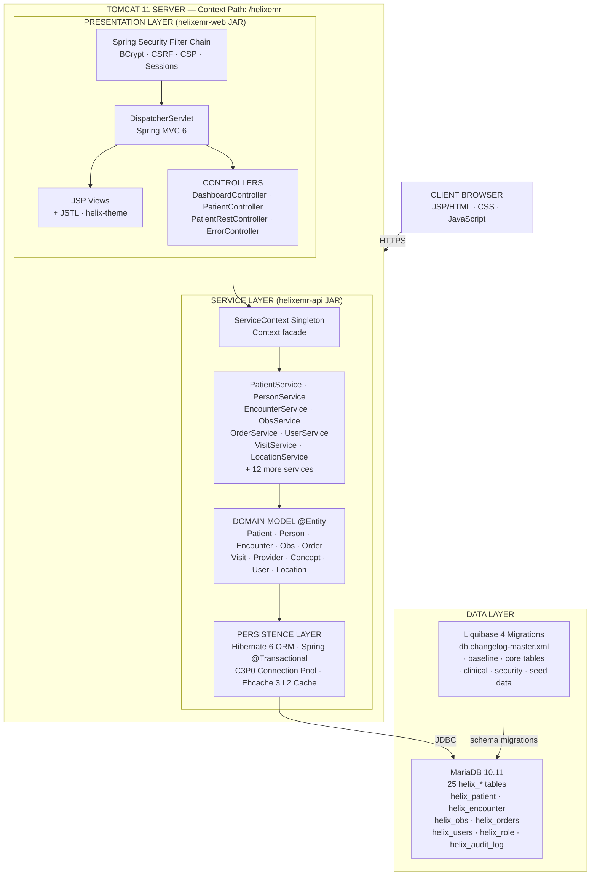

# HelixEMR

**Enterprise Electronic Medical Record System by Helix Health**

[](https://github.com/helixhealth/helixemr-core/actions)
[](https://mozilla.org/en-US/MPL/2.0/)
[](https://adoptium.net/)
[](https://github.com/helixhealth/helixemr-core/pkgs/container/helixemr)

---

## Overview

**HelixEMR** is a production-grade, enterprise Electronic Medical Record (EMR) platform built by [Helix Health](https://helixhealth.io). It extends the EMR foundation with:

- A modernized **deep-purple Helix design system**
- Enhanced **dashboards and reporting**
- Improved **clinical workflows**
- Extended **FHIR R4** and **HL7** integrations
- Enterprise-grade **security** (Spring Security 6, CSRF, CSP, audit logging)
- **Docker-first** deployment with multi-arch images
- Full **GitHub Actions CI/CD** pipeline

---

## Architecture

### System Architecture Diagram



### Request Flow

```
Browser Request
      │
      ▼
[HelixRequestFilter]  ── sets encoding, MDC, security headers
      │
      ▼
[Spring Security Filter Chain]  ── auth check, CSRF, CSP, session
      │
      ├── /helixemr/login, /static/**, /images/**  ──▶  permitAll
      │
      └── /helixemr/**  ──▶  authenticated
            │
            ▼
      [DispatcherServlet]
            │
            ▼
      [Controller]  ──▶  [ServiceContext.getXxxService()]
                                    │
                                    ▼
                            [ServiceImpl]  ──▶  [DAO]  ──▶  [MariaDB]
                                    │
                                    ▼
                            [Model attributes set]
                                    │
                                    ▼
                    [InternalResourceViewResolver]
                    /WEB-INF/view/{name}.jsp
                            │
                            ▼
                    [JSP + JSTL rendered]  ──▶  HTML Response
```

### Module Structure

```
helixemr-core/
├── bom/          Bill of Materials (import in downstream projects)
├── tools/        Build utilities and code-generation tools
├── test/         Shared test framework and base classes
├── api/          Core services, domain model, DAO interfaces  (JAR)
├── web/          Spring MVC controllers, REST endpoints, security (JAR)
├── webapp/       Deployable WAR: JSP views, CSS theme, assets  (WAR)
├── liquibase/    Database schema migrations
├── Dockerfile    Multi-stage Docker build (Temurin 21 → Tomcat 11)
├── docker-compose.yml
└── .github/workflows/  CI/CD pipelines
```

### Technology Stack

| Layer | Technology |
|-------|-----------|
| Language | Java 21 |
| Build | Maven 3.9+ |
| Web framework | Spring MVC 6.1 |
| Security | Spring Security 6.3 · BCrypt-12 · CSRF · CSP |
| Persistence | Hibernate 6.5 · Spring ORM · C3P0 · Ehcache 3 |
| Migrations | Liquibase 4.29 |
| Database | MariaDB 10.11 (H2 for tests) |
| Views | JSP · JSTL · Helix Design System |
| Container | Tomcat 11 · Eclipse Temurin JRE 21 |
| CI/CD | GitHub Actions · CodeQL · Docker GHCR |

---

## Quick Start

### Option 1 – Docker Compose (Recommended)

```bash
# Clone
git clone https://github.com/helixhealth/helixemr-core.git
cd helixemr-core

# Start the full stack (MariaDB + HelixEMR)
docker compose up -d

# Open browser
open http://localhost:8080/helixemr
```

Default credentials:
| Username | Password |
|----------|----------|
| `admin`  | `Admin1234!` |

### Option 2 – Build from Source

**Prerequisites:** Java 21, Maven 3.9+, MariaDB 10.11

```bash
# Build
./mvnw clean package -DskipTests

# Deploy WAR to Tomcat
cp webapp/target/helixemr.war $CATALINA_HOME/webapps/

# Or run with embedded Jetty (development)
./mvnw -pl webapp jetty:run
```

### Option 3 – Development Mode

```bash
docker compose -f docker-compose.yml -f docker-compose.dev.yml up -d
```
This mounts the exploded webapp and opens port `5005` for remote debugging.

---

## Configuration

All configuration is controlled via environment variables (Docker) or
`api/src/main/resources/io/helixhealth/emr/api/helixemr.properties`.

| Variable | Default | Description |
|----------|---------|-------------|
| `HELIX_DB_HOSTNAME` | `db` | Database host |
| `HELIX_DB_PORT` | `3306` | Database port |
| `HELIX_DB_NAME` | `helixemr` | Database name |
| `HELIX_DB_USERNAME` | `helixemr` | Database user |
| `HELIX_DB_PASSWORD` | `helixemr` | Database password |
| `HELIX_ADMIN_USER_PASSWORD` | `Admin1234!` | Initial admin password |
| `HELIXEMR_DATA` | `/var/lib/helixemr` | Data directory |

---

## Building

```bash
# Full build with tests and quality checks
./mvnw verify -P ci-checks

# Skip checks for fast iteration
./mvnw package -P skip-all-checks

# Run integration tests (requires MariaDB)
./mvnw verify -P integration-test

# Run only unit tests
./mvnw test
```

---

## Testing

```bash
# Unit tests
./mvnw test

# Integration tests (requires running MariaDB)
./mvnw verify -P integration-test

# Coverage report (generated at target/site/jacoco/)
./mvnw test jacoco:report
```

---

## License

HelixEMR is distributed under the **Mozilla Public License 2.0** – see [LICENSE](LICENSE).

---

*© 2026 Skillfyme. All rights reserved.*
