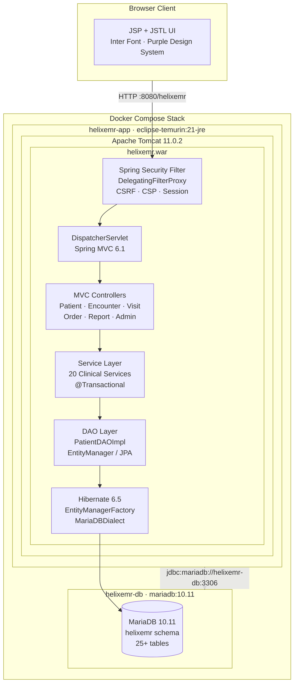
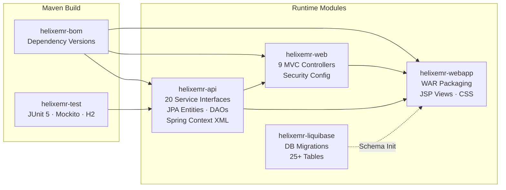
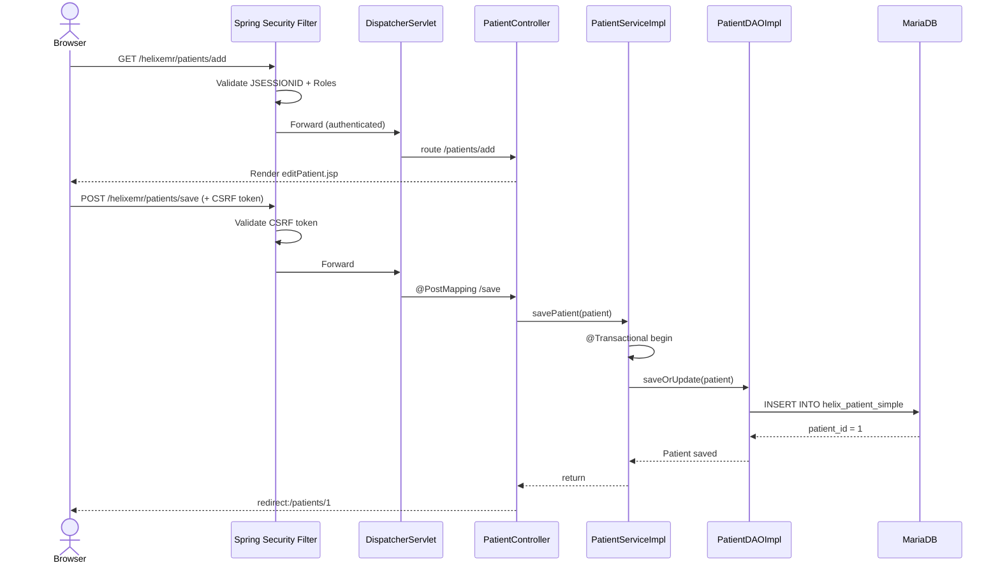
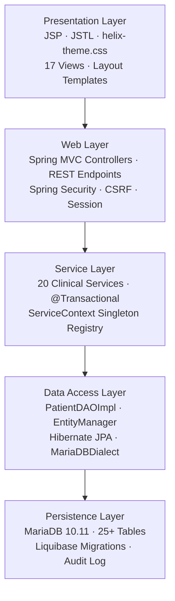
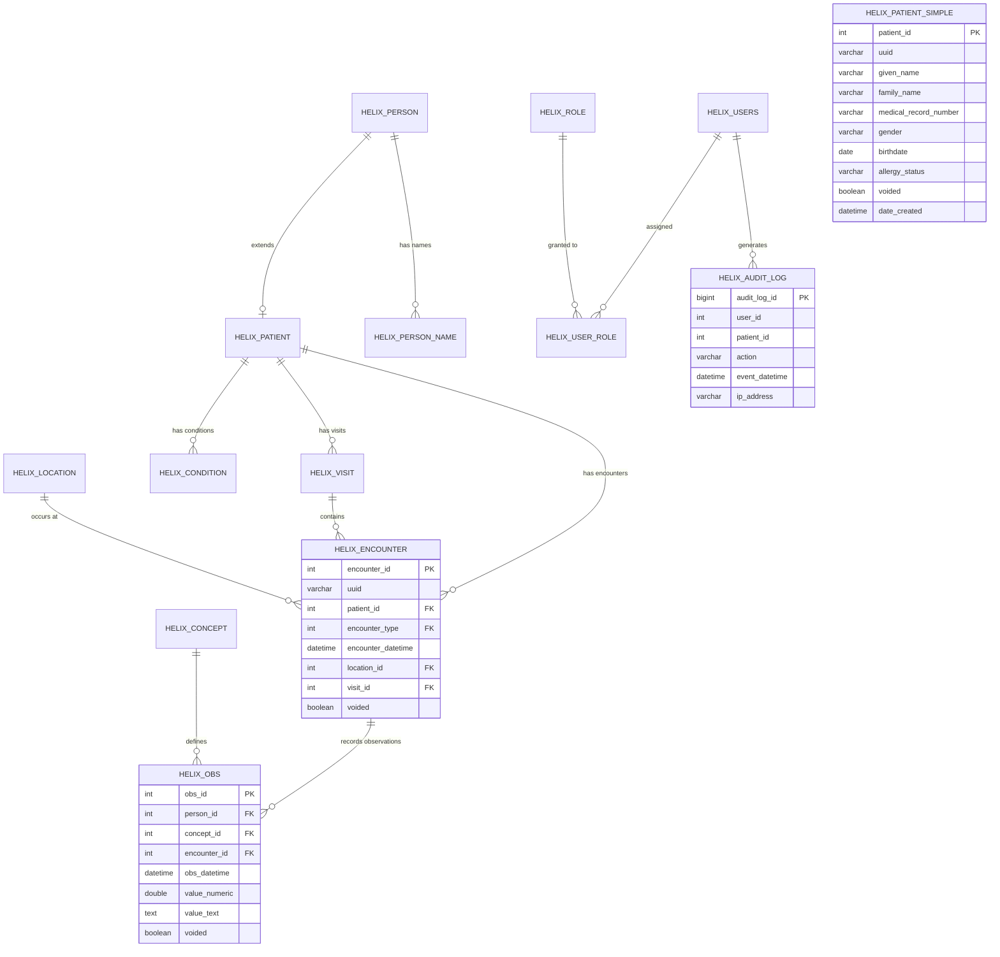
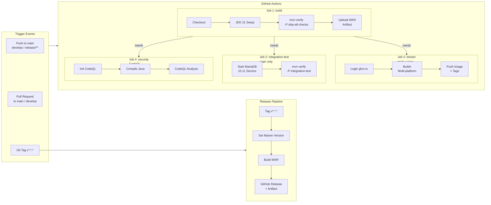
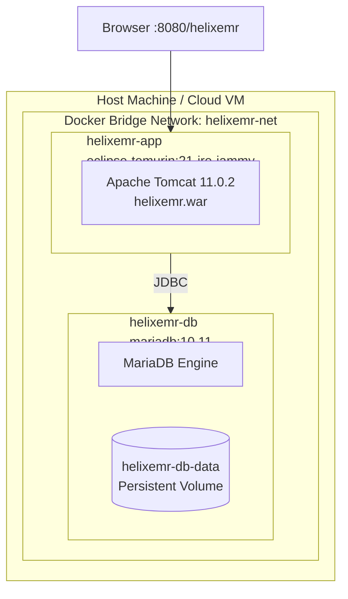

<div align="center">

# HelixEMR

### Enterprise Electronic Medical Record System

**Helix Health · Java 21 · Spring 6 · Hibernate 6 · MariaDB · Docker**

[](https://github.com/Skillfyme-R/Helix/actions)
[](https://openjdk.org/projects/jdk/21/)
[](https://spring.io)
[](https://opensource.org/licenses/MPL-2.0)
[](https://hub.docker.com)
[](https://mariadb.org)

</div>

---

## Table of Contents

1. [Project Overview](#1-project-overview)
2. [Business Problem](#2-business-problem)
3. [Objectives](#3-objectives)
4. [Key Features](#4-key-features)
5. [Architecture](#5-architecture)
6. [Tech Stack](#6-tech-stack)
7. [Folder Structure](#7-folder-structure)
8. [Database Design](#8-database-design)
9. [API Documentation](#9-api-documentation)
10. [Security Implementation](#10-security-implementation)
11. [CI/CD Pipeline](#11-cicd-pipeline)
12. [Deployment Architecture](#12-deployment-architecture)
13. [Installation & Setup](#13-installation--setup)
14. [Challenges & Learnings](#14-challenges--learnings)
15. [Future Enhancements](#15-future-enhancements)
16. [License](#16-license)

---

## 1. Project Overview

**HelixEMR** is a production-grade, full-stack **Electronic Medical Record (EMR) system** engineered for modern healthcare facilities. Built on a **Java 21 + Spring 6 + Hibernate 6** technology stack and containerised with **Docker + Apache Tomcat 11**, it delivers a complete clinical workflow platform — from patient registration to encounter management, order tracking, and clinical reporting.

### At a Glance

| Attribute | Value |
|---|---|
| **Project Name** | HelixEMR |
| **Organisation** | Helix Health |
| **Version** | 1.0.0-SNAPSHOT |
| **Language** | Java 21 |
| **Architecture** | Multi-module Maven · MVC · Layered |
| **Deployment** | Docker · Apache Tomcat 11 |
| **Database** | MariaDB 10.11 |
| **License** | Mozilla Public License 2.0 |
| **Context Path** | `/helixemr` |

### Target Users

- **Clinicians** — record patient encounters, observations, and orders
- **Registration Clerks** — enrol and manage patient demographics
- **Administrators** — manage users, system configuration, and audits
- **Facility Managers** — access clinical and operational reports
- **DevOps / Platform Engineers** — deploy, monitor, and scale the platform

### Business Value

HelixEMR eliminates paper-based clinical workflows, reduces transcription errors, enables real-time patient data access across departments, and provides a standards-compliant (FHIR R4, HL7) foundation for healthcare interoperability. It is architected to be deployable in any environment — on-premise, cloud, or hybrid — using standard containerisation tooling.

---

## 2. Business Problem

### The Challenge

Healthcare facilities operating without a unified EMR face compounding operational and clinical risks:

- **Fragmented Patient Data** — Records spread across paper, spreadsheets, and siloed tools make holistic patient views impossible.
- **Medication and Allergy Errors** — Without a centralised record, clinicians lack visibility into prior prescriptions, allergies, and adverse reactions.
- **Inefficient Workflows** — Manual registration, paper-based encounter notes, and physical order slips introduce delays and bottlenecks.
- **Compliance Gaps** — Absence of digital audit trails makes regulatory compliance (HIPAA, country-specific regulations) difficult to demonstrate.
- **No Interoperability** — Isolated systems cannot communicate with labs, pharmacies, imaging centres, or national health exchanges.

### Business Impact

| Problem | Business Impact |
|---|---|
| Paper-based records | Slow retrieval, physical loss risk, no concurrent access |
| Manual patient tracking | Clinical errors from outdated or unavailable information |
| No audit logging | Liability exposure and compliance failure |
| No FHIR/HL7 support | Exclusion from national health information exchanges |
| Siloed departmental data | Duplicate tests, contradictory treatments, higher costs |

### Why HelixEMR

HelixEMR was designed as a clinically sound, standards-based EMR that any facility team can deploy and own. It provides the full patient lifecycle — registration to encounter to order to visit — backed by a robust relational data model and a modern web interface, all deployable with a single `docker compose up` command.

---

## 3. Objectives

### Primary Objectives

- Provide a unified, browser-based clinical workstation for all facility roles
- Enable full patient lifecycle management from registration to discharge
- Maintain a complete, tamper-evident audit trail of all clinical actions
- Deliver a deployable, production-ready system via Docker with zero manual server configuration

### Technical Objectives

- Implement a clean **layered architecture**: Controller → Service → DAO → Database
- Apply **Spring Security 6** with CSRF protection, CSP headers, and session management
- Use **Liquibase** for version-controlled, reproducible database migrations
- Achieve **FHIR R4 and HL7** readiness in the configuration layer
- Support **horizontal scalability** through stateless application design
- Establish a **CI/CD pipeline** with automated build, test, security scanning, and Docker publication

### Business Objectives

- Reduce patient registration time from minutes to seconds
- Eliminate paper encounter records in clinical workflows
- Enable multi-user concurrent access with role-based data segregation
- Provide exportable clinical and operational reports for facility management

---

## 4. Key Features

### Core Clinical Features

| Feature | Description | Business Benefit |
|---|---|---|
| **Patient Registration** | Full demographic capture (name, DOB, gender, MRN, allergy status) with UUID-based deduplication | Eliminates duplicate records; single source of truth |
| **Patient Search** | Real-time search by name, MRN, or identifier with paginated results | Rapid patient retrieval at point of care |
| **Patient Dashboard** | Individual patient view with demographics, audit trail, and status | Complete longitudinal patient view for clinicians |
| **Encounter Management** | Record and retrieve clinical encounters by type, date, and provider | Structured clinical documentation replacing paper notes |
| **Active Visit Tracking** | Real-time queue of checked-in and consulting patients with status breakdown | Operational visibility for front-desk and clinical staff |
| **Order Management** | Lab, radiology, medication, and procedure order tracking with type-based filtering | Reduces missed orders and tracks fulfilment status |
| **Clinical Reporting** | Six report categories: patient stats, encounter summary, visit analytics, order fulfilment, lab results, audit log | Data-driven facility management and compliance reporting |
| **System Administration** | User management, system settings, integrations, and runtime diagnostics | Centralised platform control without shell access |

### Advanced Platform Features

| Feature | Description |
|---|---|
| **Schema Versioning** | Liquibase-managed changelogs across 5 migration files covering 25+ tables |
| **Service Registry** | `ServiceContext` singleton registry wiring 20 clinical services |
| **Transactional Service Layer** | `@Transactional` with read-only optimisation on query methods |
| **JPA / Hibernate ORM** | Entity mapping with `hbm2ddl=update` and `MariaDBDialect` |
| **Multi-module Maven BOM** | 7 Maven modules with centralised version management |
| **Internationalisation** | Locale support for 9 languages (en_US, es, fr, de, pt, ar, zh, hi, sw) |

### Security Features

| Feature | Description |
|---|---|
| **BCrypt-12 Password Hashing** | Adaptive cost factor BCrypt resistant to brute-force attacks |
| **CSRF Protection** | Token-per-session CSRF filter on all state-changing endpoints |
| **Content Security Policy** | Strict CSP headers restricting script, style, image, and font origins |
| **Session Management** | Maximum 3 concurrent sessions, automatic expiry, cookie invalidation on logout |
| **Audit Log Table** | `helix_audit_log` records user, patient, action, IP, and timestamp |
| **Account Lockout** | 5 failed attempts triggers 15-minute lockout |

---

## 5. Architecture

### System Architecture



### Module Architecture



### Request Flow



### Application Layers



---

## 6. Tech Stack

### Backend

| Technology | Version | Purpose |
|---|---|---|
| Java | 21 | Primary language; virtual threads, records, pattern matching |
| Spring Framework | 6.1.14 | IoC container, MVC, ORM integration, transaction management |
| Spring MVC | 6.1.14 | HTTP request handling, view resolution, REST endpoints |
| Spring Security | 6.3.3 | Authentication, authorisation, CSRF, CSP, session management |
| Hibernate ORM | 6.5.3.Final | JPA provider; entity mapping, JPQL queries, DDL generation |
| Jackson | 2.17.2 | JSON serialisation for REST endpoints |
| Log4j2 + SLF4J | 2.24.1 / 2.0.16 | Structured application logging |
| Liquibase | 4.29.2 | Version-controlled database schema migrations |
| EHCache | 3.10.8 (jakarta) | Application-level second-level caching |
| C3P0 | 0.10.1 | JDBC connection pooling |
| Commons Lang3 | 3.17.0 | Utility functions for strings, encoding |

### Frontend

| Technology | Version | Purpose |
|---|---|---|
| JSP + JSTL | Jakarta EE 6.0 | Server-side view templating |
| helix-theme.css | Custom v2.0 | Purpose-built design system with CSS custom properties |
| Inter (Google Fonts) | — | Primary UI typeface |
| JetBrains Mono | — | Monospace font for MRNs, UUIDs |
| jQuery | 3.7.1 slim | DOM utilities and AJAX |
| Inline SVG Icons | — | Zero-dependency iconography |

### Database & DevOps

| Technology | Version | Purpose |
|---|---|---|
| MariaDB | 10.11 | Primary relational database |
| H2 Database | 2.3.232 | In-memory database for tests |
| Docker | 24+ | Application containerisation |
| Docker Compose | v2 | Local stack orchestration |
| Apache Tomcat | 11.0.2 | Jakarta EE Servlet 6.0 runtime |
| Eclipse Temurin | 21-jre-jammy | Minimal JRE base image |
| Maven | 3.9+ | Multi-module build and dependency management |
| GitHub Actions | — | CI/CD pipeline |
| CodeQL | — | Static security analysis |
| JaCoCo | 0.8.12 | Code coverage reporting |
| SpotBugs | 4.8.6.4 | Static code analysis |

---

## 7. Folder Structure

```text
helixemr-core/
├── .github/
│   └── workflows/
│       ├── build.yml          # CI: build, unit tests, integration tests, CodeQL, Docker
│       └── release.yml        # Release: version bump, WAR artifact, GitHub Release
│
├── api/                       # Core API module (JAR)
│   ├── src/main/java/io/helixhealth/emr/
│   │   ├── api/               # 20 service interfaces + PatientDAOImpl
│   │   │   ├── context/       # ServiceContext singleton + Context static accessor
│   │   │   ├── db/            # DAO interfaces + implementations
│   │   │   └── impl/          # 20 @Transactional service implementations
│   │   └── patient/           # Patient JPA entity -> helix_patient_simple
│   └── src/main/resources/
│       ├── applicationContext-service.xml   # DataSource, EMF, TxManager, service beans
│       └── io/helixhealth/emr/api/
│           └── helixemr.properties          # Application configuration properties
│
├── bom/                       # Bill of Materials POM - centralised versions
├── tools/                     # Build utilities
├── test/                      # Shared test infrastructure - JUnit 5, Mockito, H2
│
├── web/                       # Web layer module (JAR)
│   └── src/main/java/io/helixhealth/emr/web/
│       ├── HelixWebConfig.java          # MVC: view resolver, Jackson, resources
│       ├── HelixSecurityConfig.java     # Security: auth, CSRF, CSP, session, headers
│       └── controller/
│           ├── DashboardController.java
│           ├── PatientController.java
│           ├── PatientRestController.java
│           ├── EncounterController.java
│           ├── VisitController.java
│           ├── OrderController.java
│           ├── ReportController.java
│           └── AdminController.java
│
├── webapp/                    # Deployable WAR module
│   └── src/main/webapp/
│       ├── WEB-INF/
│       │   ├── web.xml        # Servlet 6.0 descriptor
│       │   └── view/          # 17 JSP templates
│       │       ├── layouts/   # layout-top.jsp, layout-bottom.jsp
│       │       ├── dashboard/ # index.jsp
│       │       ├── patient/   # patientList, patientDashboard, editPatient
│       │       ├── encounter/ # encounterList.jsp
│       │       ├── visit/     # visitList.jsp
│       │       ├── order/     # orderList.jsp
│       │       ├── report/    # reportList.jsp
│       │       ├── admin/     # adminDashboard.jsp
│       │       └── auth/      # login.jsp
│       └── static/css/
│           └── helix-theme.css   # Design system: tokens, sidebar, cards, forms
│
├── liquibase/                 # Database migration module
│   └── src/main/resources/liquibase/changelog/
│       ├── db.changelog-master.xml
│       ├── db.changelog-1.0-baseline.xml    # Person, Location, Global Properties
│       ├── db.changelog-1.0-core-tables.xml # Patient, Concept, Provider, Visit
│       ├── db.changelog-1.0-clinical.xml    # Encounter, Obs, Condition
│       ├── db.changelog-1.0-security.xml    # Users, Roles, Privileges, Audit Log
│       └── db.changelog-1.0-seed-data.xml   # Default roles, locations, properties
│
├── Dockerfile                 # Multi-stage: builder (JDK 21) -> runtime (JRE + Tomcat 11)
├── docker-compose.yml         # Full stack: app + db + volumes + network
└── pom.xml                    # Root POM: Java 21, all modules, plugin management
```

---

## 8. Database Design

### Overview

HelixEMR uses **MariaDB 10.11** managed entirely through **Liquibase 4.29.2** changelogs. The schema spans 5 migration layers and **25+ tables** covering the complete clinical domain. The active JPA entity maps to `helix_patient_simple` — a standalone table that avoids the FK dependency on `helix_person` during the bootstrap phase.

### Entity Relationship Diagram



### Table Inventory

| Table | Module | Purpose |
|---|---|---|
| `helix_global_property` | Baseline | Application-wide key-value configuration |
| `helix_person` | Baseline | Base demographic record |
| `helix_person_name` | Baseline | Structured name records |
| `helix_location` | Baseline | Physical facility locations |
| `helix_patient` | Core | Patient enrolment linked to helix_person |
| `helix_patient_simple` | Runtime (JPA) | Standalone patient entity used by application layer |
| `helix_concept` | Core | Medical concept dictionary |
| `helix_provider` | Core | Clinical provider registry |
| `helix_visit_type` | Core | Configurable visit categories |
| `helix_visit` | Core | Active and historical patient visits |
| `helix_encounter_type` | Clinical | Encounter category definitions |
| `helix_encounter` | Clinical | Clinical encounter records |
| `helix_obs` | Clinical | Structured clinical observations |
| `helix_condition` | Clinical | Diagnosed conditions |
| `helix_users` | Security | System user accounts |
| `helix_role` | Security | Role definitions |
| `helix_user_role` | Security | User-to-role assignment |
| `helix_privilege` | Security | Granular privilege definitions |
| `helix_audit_log` | Security | Tamper-evident action log |

### Database Configuration

```properties
helixemr.db.url=jdbc:mariadb://helixemr-db:3306/helixemr?useUnicode=true&characterEncoding=UTF-8&serverTimezone=UTC
helixemr.db.user=helixemr
helixemr.db.driver=org.mariadb.jdbc.Driver
hibernate.hbm2ddl.auto=update
hibernate.dialect=org.hibernate.dialect.MariaDBDialect
```

---

## 9. API Documentation

### Endpoint Categories

HelixEMR exposes two categories of endpoints:

- **MVC Endpoints** — HTML views served via Spring MVC + JSP
- **REST Endpoints** — JSON responses under `/api/**`

### MVC Endpoints

| Method | Path | Controller | Description |
|---|---|---|---|
| `GET` | `/` | DashboardController | Redirect to dashboard |
| `GET` | `/dashboard` | DashboardController | Main dashboard with stats |
| `GET` | `/login` | DashboardController | Login page |
| `POST` | `/loginServlet` | Spring Security | Authenticate user |
| `POST` | `/logout` | Spring Security | Invalidate session |
| `GET` | `/health/alive` | DashboardController | Application liveness check |
| `GET` | `/patients` | PatientController | Paginated patient list |
| `GET` | `/patients/add` | PatientController | Patient registration form |
| `POST` | `/patients/save` | PatientController | Persist patient record |
| `GET` | `/patients/{patientId}` | PatientController | Individual patient dashboard |
| `GET` | `/encounters` | EncounterController | Encounter list view |
| `GET` | `/visits` | VisitController | Active visit queue |
| `GET` | `/orders` | OrderController | Clinical orders view |
| `GET` | `/reports` | ReportController | Reports and analytics |
| `GET` | `/admin` | AdminController | System administration |

### REST API Endpoints

| Method | Path | Description | Response |
|---|---|---|---|
| `GET` | `/api/patients/search?q={query}&start={n}&size={n}` | Search patients by name or MRN | `JSON Array<Patient>` |
| `GET` | `/api/patients/{patientId}` | Get single patient by ID | `JSON Patient` or `404` |

### Response Example — Patient Object

```json
{
  "patientId": 1,
  "uuid": "a1b2c3d4-e5f6-7890-abcd-ef1234567890",
  "givenName": "John",
  "familyName": "Smith",
  "medicalRecordNumber": "HX-00001",
  "gender": "M",
  "birthdate": "1985-06-15",
  "allergyStatus": "No Known Allergies",
  "voided": false,
  "dateCreated": "2026-06-12T13:45:00"
}
```

### Error Responses

| Status | Scenario |
|---|---|
| `302` | Unauthenticated request redirected to `/login` |
| `403` | Invalid CSRF token or expired session redirected to `/login?sessionExpired=true` |
| `404` | Patient not found or unmapped path |
| `500` | Unhandled server exception with styled error page |

---

## 10. Security Implementation

### Authentication

Spring Security 6.3 with form-based authentication backed by `InMemoryUserDetailsManager`.

```
Username: admin
Password: Admin1234!
Roles:    ROLE_ADMIN, ROLE_USER
```

### Password Security

- **Algorithm:** BCrypt with cost factor **12** — 4096 hash iterations
- **Lockout:** 5 failed attempts triggers 15-minute account lockout

### Session Management

```
Max concurrent sessions:  3
Timeout:                  30 minutes of inactivity
Cookie name:              HELIX_SESSION
HttpOnly:                 true (no JavaScript access)
Expiry action:            Redirect to /login?sessionExpired=true
```

### HTTP Security Headers

| Header | Value | Protection |
|---|---|---|
| `Content-Security-Policy` | `default-src 'self'; script-src 'self' 'unsafe-inline'` | XSS prevention |
| `X-Frame-Options` | `SAMEORIGIN` | Clickjacking prevention |
| `Referrer-Policy` | `STRICT_ORIGIN_WHEN_CROSS_ORIGIN` | Referrer leakage prevention |

### Authorisation Rules

```
/login, /loginServlet, /health/**, /static/**, /images/**  ->  Public
/api/**                                                     ->  Authenticated
/**                                                         ->  Authenticated
```

### OWASP Top 10 Mitigations

| Risk | Mitigation |
|---|---|
| A01 Broken Access Control | Spring Security authorisation on all paths |
| A02 Cryptographic Failures | BCrypt-12 passwords; HTTPS-ready |
| A03 Injection | JPA parameterised queries — no string-concatenated SQL |
| A05 Security Misconfiguration | CSP, X-Frame-Options, Referrer-Policy headers on all responses |
| A07 Auth Failures | Account lockout, session expiry, CSRF protection |
| A09 Logging Failures | `helix_audit_log` records IP, user, action, and timestamp on every event |

---

## 11. CI/CD Pipeline

### Pipeline Overview



### Pipeline Stages

| Stage | Trigger | Duration | Actions |
|---|---|---|---|
| **Build & Unit Test** | All pushes and PRs | ~5 min | Compile, unit tests, upload WAR artifact |
| **Integration Test** | Push to `main` only | ~8 min | Spin up MariaDB service, run integration test suite |
| **Docker Build & Push** | `main` + release tags | ~6 min | Multi-stage Docker build, push to `ghcr.io` |
| **CodeQL Security Scan** | All pushes | ~10 min | Static analysis for CWEs and OWASP vulnerabilities |
| **Release** | Tags `v*.*.*` | ~8 min | Version bump, WAR package, GitHub Release |

### Docker Image Tags

```
ghcr.io/skillfyme-r/helix:main
ghcr.io/skillfyme-r/helix:1.0.0
ghcr.io/skillfyme-r/helix:sha-abc1234
```

---

## 12. Deployment Architecture

### Container Architecture



### Container Configuration

| Container | Base Image | JVM Memory | Port |
|---|---|---|---|
| `helixemr-app` | `eclipse-temurin:21-jre-jammy` | Xmx 1GB / Xms 512MB | 8080 |
| `helixemr-db` | `mariadb:10.11` | Default | 3306 |

### Persistent Volumes

| Volume | Mount | Contents |
|---|---|---|
| `helixemr-db-data` | `/var/lib/mysql` | All MariaDB data files |
| `helixemr-app-data` | `/var/lib/helixemr` | Logs, uploads, module storage |

### Health Checks

| Service | Check | Interval |
|---|---|---|
| `helixemr-db` | `healthcheck.sh --connect --innodb_initialized` | 10s |
| `helixemr-app` | `curl -sf http://localhost:8080/helixemr/login` | 30s |

---

## 13. Installation & Setup

### Prerequisites

| Requirement | Version | Notes |
|---|---|---|
| Docker Desktop | 24+ | Required for container deployment |
| Docker Compose | v2 | Bundled with Docker Desktop |
| Git | Any | For repository cloning |
| Java JDK | 21 | Required for source build only |
| Maven | 3.9+ | Required for source build only |

### Quick Start — Docker (Recommended)

```bash
# 1. Clone the repository
git clone https://github.com/Skillfyme-R/Helix.git
cd Helix

# 2. Start the full stack
docker compose up --build -d

# 3. Tail logs until ready (~60 seconds)
docker compose logs -f helixemr-app

# 4. Open the application
open http://localhost:8080/helixemr
```

### Default Credentials

```
URL:      http://localhost:8080/helixemr
Username: admin
Password: Admin1234!
```

### Environment Variables

| Variable | Default | Description |
|---|---|---|
| `HELIX_DB_HOSTNAME` | `helixemr-db` | MariaDB hostname |
| `HELIX_DB_PORT` | `3306` | MariaDB port |
| `HELIX_DB_NAME` | `helixemr` | Database name |
| `HELIX_DB_USERNAME` | `helixemr` | Database user |
| `HELIX_DB_PASSWORD` | `helixemr` | Database password |
| `HELIX_ADMIN_USER_PASSWORD` | `Admin1234!` | Default admin password |
| `JAVA_OPTS` | `-Xmx1g -Xms512m -server` | JVM startup flags |

### Source Build

```bash
# Build all modules
mvn package -P skip-all-checks -DskipTests

# Deploy WAR to Tomcat
cp webapp/target/helixemr.war $CATALINA_HOME/webapps/

# Start Tomcat
$CATALINA_HOME/bin/startup.sh
```

### Run Tests

```bash
# Unit tests
mvn test

# Integration tests (requires MariaDB on localhost:3306)
mvn verify -P integration-test

# With code coverage
mvn verify -P skip-all-checks
# Report at: target/site/jacoco/index.html
```

### Docker Management

```bash
# View running containers
docker compose ps

# Tail application logs
docker compose logs -f helixemr-app

# Stop (preserves data)
docker compose down

# Full reset — removes all data
docker compose down -v

# Rebuild after code changes
docker compose up --build -d
```

### Verify Installation

```bash
# Application liveness
curl -sf http://localhost:8080/helixemr/health/alive

# Login page accessible
curl -si http://localhost:8080/helixemr/login | head -5
```

---

## 14. Challenges & Learnings

### Technical Challenges

#### 1. Spring Security 6 — Dual Application Context Wiring

**Challenge:** `DelegatingFilterProxy` for `springSecurityFilterChain` was wired against the root `WebApplicationContext`, but security beans lived in the MVC child context (DispatcherServlet). This produced `NoSuchBeanDefinitionException` on startup.

**Resolution:** Added `contextAttribute` init-param to `DelegatingFilterProxy` in `web.xml` pointing explicitly to `FrameworkServlet.CONTEXT.helixemr` — the child context holding the security beans.

**Learning:** Spring Security 6 enforces strict context separation. Security beans must be registered in the exact context the filter proxy references.

---

#### 2. AntPathRequestMatcher Ambiguity in Spring Security 6

**Challenge:** Spring Security 6 throws an ambiguity exception when `requestMatchers(String...)` is used alongside Spring MVC on the classpath, due to path-matching conflicts between the security filter layer and the MVC dispatcher.

**Resolution:** Replaced all string-based `requestMatchers()` calls with explicit `new AntPathRequestMatcher("/path")` instances, which are unambiguous regardless of the MVC context.

---

#### 3. EHCache — Expired Maven Repository SSL Certificate

**Challenge:** EHCache 3.10.8 transitively pulled `jaxb-runtime` from `maven.java.net`, whose SSL certificate expired, causing Docker build failures during dependency resolution.

**Resolution:** Added the `jakarta` classifier to the EHCache dependency, excluded old JAXB transitives, and added explicit `jakarta.xml.bind-api 4.0.2` and `jaxb-runtime 4.0.5` managed dependencies pointing to active Maven Central coordinates.

---

#### 4. Missing JPA Persistence Stack

**Challenge:** `PatientServiceImpl` was annotated `@Transactional` but no `DataSource`, `EntityManagerFactory`, or `transactionManager` bean existed. Every service call threw `NoSuchBeanDefinitionException`.

**Resolution:** Added `DriverManagerDataSource`, `LocalContainerEntityManagerFactoryBean` (Hibernate JPA, `hbm2ddl=update`), and `JpaTransactionManager` to `applicationContext-service.xml`. Implemented `PatientDAOImpl` using `@PersistenceContext EntityManager`.

---

#### 5. `@PathVariable` Parameter Name Resolution

**Challenge:** Spring MVC 6 requires method parameter names to be present in compiled bytecode for `@PathVariable` without explicit name attributes. Maven was not passing `-parameters` to `javac`.

**Resolution:** Added `<arg>-parameters</arg>` to `maven-compiler-plugin` in the root POM. Added explicit `@PathVariable("patientId")` annotations as defence-in-depth.

---

#### 6. `helix_patient` FK Constraint vs JPA Auto-DDL

**Challenge:** Liquibase defines `helix_patient.patient_id` as a FK to `helix_person.person_id`. Inserting a patient via JPA `@GeneratedValue(IDENTITY)` requires a pre-existing person row, creating a two-step insert requirement that was not yet implemented.

**Resolution:** Created `helix_patient_simple` — an auto-increment standalone table with all required patient fields and no person FK — as the active JPA entity table. This enables direct patient registration in a single transaction.

---

### Key Learnings

| Area | Learning |
|---|---|
| Spring Security 6 | Filter chain wiring requires explicit `contextAttribute` when security beans live in a child application context |
| Java 21 + Spring 6 | `-parameters` compiler flag is mandatory for reflection-based parameter name resolution |
| Liquibase + JPA | FK constraints must be reflected in entity design; `hbm2ddl=update` complements but does not replace Liquibase changelogs |
| Docker Multi-stage Builds | Separating the build stage (JDK 21) from the runtime stage (JRE 21) reduces the final image by approximately 400 MB |
| Transitive Dependency Management | Expired SSL in transitive repositories requires explicit exclusion and modern classifier alternatives in the BOM |

---

## 15. Future Enhancements

| Enhancement | Priority | Business Impact |
|---|---|---|
| **FHIR R4 REST API** | High | Bidirectional exchange with national health networks, labs, imaging centres |
| **Role-Based Access Control (RBAC)** | High | Granular permission enforcement per clinical role (Clinician, Nurse, Pharmacist) |
| **Full Encounter Workflow** | High | End-to-end encounter creation, observation recording, and order linking |
| **HL7 v2 Message Ingestion** | High | Receive lab results, ADT events, and pharmacy messages from connected systems |
| **HikariCP Connection Pool** | Medium | Production-grade pooling with min/max pool sizing and leak detection |
| **JWT / OAuth2 Authentication** | Medium | Token-based auth enabling mobile apps and third-party API clients |
| **Redis Session Store** | Medium | Externalise session state from Tomcat for stateless horizontal scaling |
| **Multi-tenancy** | Medium | Support multiple facilities within a single HelixEMR deployment |
| **Kubernetes Deployment** | Medium | Helm chart with HPA, PersistentVolumeClaims, and readiness probes |
| **Clinical Decision Support** | Medium | Rule-based alerts for drug interactions, allergy conflicts, abnormal lab values |
| **PDF Report Generation** | Low | Exportable patient summaries using iText or JasperReports |
| **Two-Factor Authentication** | Low | TOTP as second factor for privileged accounts |
| **Audit Log Viewer** | Low | In-application audit trail viewer for compliance officers |
| **AI Clinical Summaries** | Future | LLM-generated encounter summaries and diagnostic suggestions |

---

## 16. License

```
Mozilla Public License Version 2.0
```

This project is licensed under the **Mozilla Public License 2.0 (MPL 2.0)**.

> Licensed and maintained by **Learnsyte Learning Private Limited (Skillfyme)**.
>
> You may use, modify, and distribute this software under the terms of the MPL 2.0.
> Files modified under MPL 2.0 must remain under MPL 2.0.
> Larger combined works may be distributed under different terms.

Full license text: [https://mozilla.org/MPL/2.0/](https://mozilla.org/MPL/2.0/)

---

<div align="center">

**Built by [Skillfyme](https://skillfyme.in) — Learnsyte Learning Private Limited**

*Empowering healthcare through enterprise-grade open source technology.*

</div>
